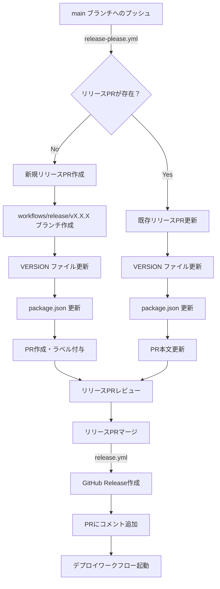

# リリースフロー

このドキュメントでは、本プロジェクトにおけるリリースフローの仕組みについて詳細に説明します。

## 概要

本プロジェクトでは、GitHub Actionsを使用した自動化されたリリースフローを採用しています。主要なコンポーネントは以下の通りです：

1. **release-please.yml** - リリースPRの作成・更新を自動化
2. **release.yml** - リリースPRマージ後のGitHubリリース作成を自動化
3. カスタムバージョニング（YYYY.M.BUILD形式）

## バージョニング規則

本プロジェクトでは独自のバージョニング形式を採用しています：

```
YYYY.M.BUILD
```

- **YYYY**: 年（4桁）
- **M**: 月（1-12、ゼロパディングなし）
- **BUILD**: その月のビルド番号（0から開始）

例：
- `2025.5.0` - 2025年5月の最初のリリース
- `2025.5.1` - 2025年5月の2番目のリリース
- `2025.6.0` - 2025年6月の最初のリリース

## リリースフロー図解



## ワークフロー詳細

### 1. release-please.yml

このワークフローは、mainブランチへのプッシュまたは手動実行時に動作します。

#### トリガー
- `push` to `main` ブランチ
- `workflow_dispatch`（手動実行）

#### 主要ジョブ

**validate**
1. 新しいバージョンを計算（resolve-versions action使用）
2. リリースノートを生成（generate-release-note-body action使用）
3. アクションを決定：
   - `create`: 新規リリースPR作成
   - `update`: 既存リリースPR更新
   - `none`: 何もしない

**create-pr**（新規作成時）
1. リリースブランチ作成（`workflows/release/vX.X.X`）
2. VERSIONファイルとpackage.jsonを更新
3. リリースPRを作成
4. `ignore for release`ラベルを付与

**update-pr**（更新時）
1. 既存のリリースブランチを更新
2. VERSIONファイルとpackage.jsonを更新
3. PR本文を最新のリリースノートで更新

### 2. release.yml

このワークフローは、リリースPRがマージされた時に動作します。

#### トリガー
- リリースPRのマージ（`VERSION`ファイルの変更を含む）

#### 主要ステップ
1. 新しいバージョンを解決
2. GitHubリリースを作成（タグ: `vX.X.X`）
3. リリースノートを自動生成
4. PRにリリースURLをコメント

## 関連コンポーネント

### GitHub Actions

#### resolve-versions
- 現在のバージョンをVERSIONファイルから取得
- 新しいバージョンを計算（年月が変わったら0にリセット）

#### generate-release-note-body
- GitHub APIを使用してリリースノートを自動生成
- コミット履歴から変更内容を抽出

### スクリプト

#### release-pr-common.cjs
共通機能を提供：
- mainブランチのSHA取得
- ブランチの作成・確認
- VERSIONファイルとpackage.jsonの更新
- 変更のコミット

#### release-pr-create.cjs
新規リリースPR作成：
- リリースブランチの準備
- PR作成とラベル付与

#### release-pr-update.cjs
既存リリースPR更新：
- リリースブランチの更新
- PR本文の更新

### 設定ファイル

#### VERSION
現在のバージョンを保持：
```
2025.6.0
```

## セキュリティ

- GitHub App Token（BOT_APP_ID、BOT_PRIVATE_KEY）を使用
- 適切な権限設定（contents: write、pull-requests: write、issues: write）

## トラブルシューティング

### リリースPRが作成されない場合
1. mainブランチへのプッシュ権限を確認
2. GitHub App Tokenの設定を確認
3. ワークフローの実行ログを確認

### バージョンが正しく更新されない場合
1. VERSIONファイルの形式を確認
2. resolve-versions actionのログを確認
3. 日付設定（タイムゾーン）を確認

### リリースが作成されない場合
1. リリースPRが正しくマージされたか確認
2. VERSIONファイルの変更が含まれているか確認
3. release.ymlワークフローの実行ログを確認